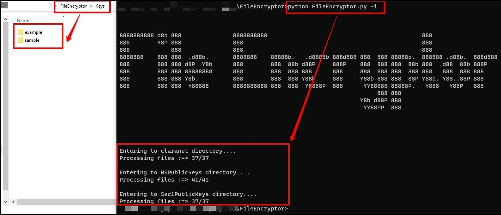
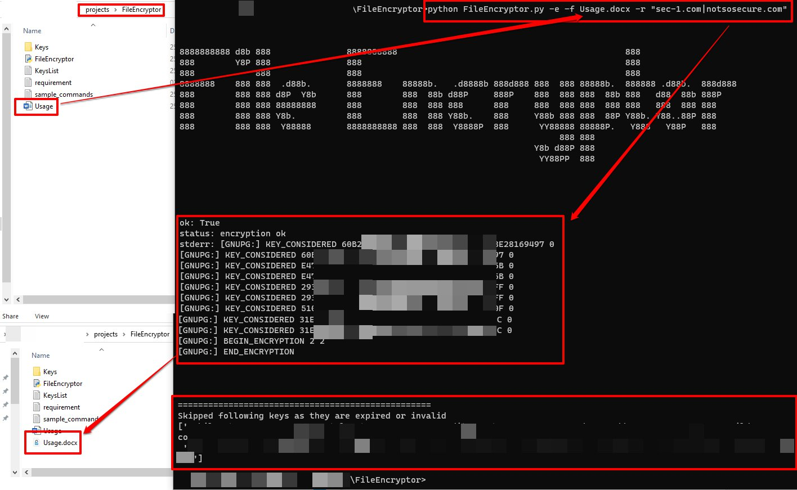

# FileEncryptor
Tool to import and encrypt report using multiple recipient.


Import PGP Keys




Encrypt file


## Command to encrypt document with all pgp public key ending with 'example.com'
```
python FileEncryptor.py -e -f Usage.docx -r "example.com"
```

## Command to encrypt document with all the mentioned recipient email
```
python FileEncryptor.py -e -f Usage.docx -r "sample@example.com|example@sample.com|example@example.com|sample@sample.com"
```

## command to encrypt document with all pgp public key ending with any of the following organization.
```
python FileEncryptor.py -e -f Usage.docx -r "example.com|example.org|sample.com"
```