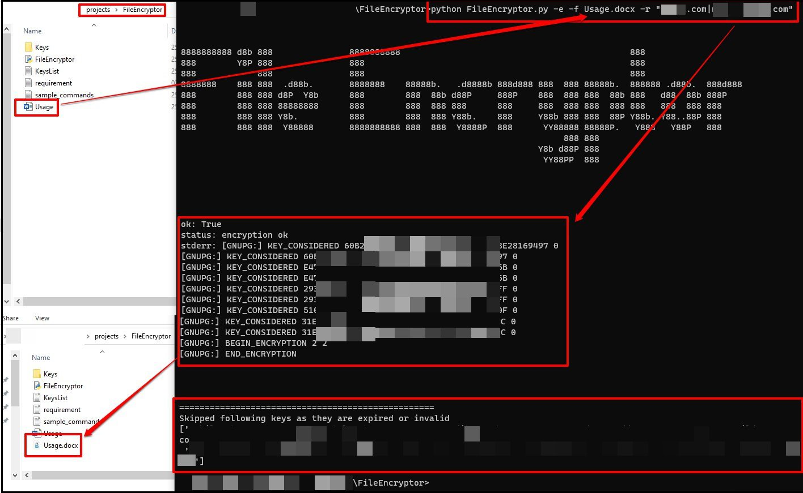

# FileEncryptor

It's command line python based tool which can be used to import multiple keys and encrypt the specific file using specificied recipient, recipient belongs to specific organization or recipient belongs to specific multiple organization.

## Pre-requisite

- Windows/linux
- python3

## Installation

  ```
  pip install -r requirement.txt
  ```

## Sample Commands

- To import all pgp keys from keys directory

  ```
  python FileEncryptor.py -i
  ```

- Command to encrypt document with all pgp public key ending with 'example.com'

  ```
  python FileEncryptor.py -e -r "example.com" -f Usage.docx
  ```

- Command to encrypt document with all the mentioned recipient email

  ```
  python FileEncryptor.py -e -r "sample@example.com|example@sample.com|example@example.com" -f Usage.docx
  ```

- command to encrypt document with all pgp public key ending with any of the following organization.

  ```
  python FileEncryptor.py -e -r "example.com|example.org|sample.com" -f Usage.docx
  ```
  
  
## How to Import PGP Keys?


## How to encrypt file?




## References

- https://pythonhosted.org/gnupg/gnupg.html